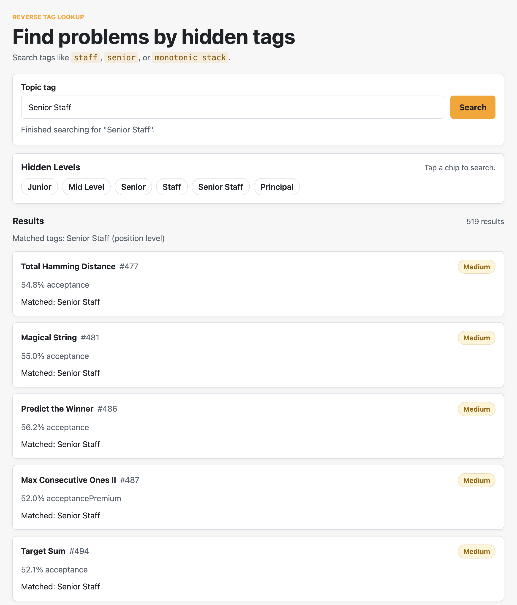

# Reverse Tag Lookup

Find LeetCode problems by hidden position-level tags such as `Staff`, `Senior Staff`, and `Principal`, plus normal topic tags such as `Monotonic Stack`.



## Requirements

Install Docker Desktop:

```text
https://www.docker.com/products/docker-desktop/
```

Make sure Docker Desktop is running before starting the app.

## Run From GitHub

Clone the repo:

```sh
git clone https://github.com/breadream/reverse_tag_lookup.git
cd reverse_tag_lookup
```

Start the app:

```sh
docker compose up --build
```

Open the app:

```text
http://127.0.0.1:3001
```

Stop the app:

```sh
Ctrl+C
```

## What To Expect

The first search can take a little while because the backend builds a local cache from LeetCode. After that, searches are much faster.

The Docker volume `reverse-tag-cache` keeps that cache between runs.

## Run Without Docker

If you have Rust installed:

```sh
PORT=3001 cargo run
```

Then open:

```text
http://127.0.0.1:3001
```
